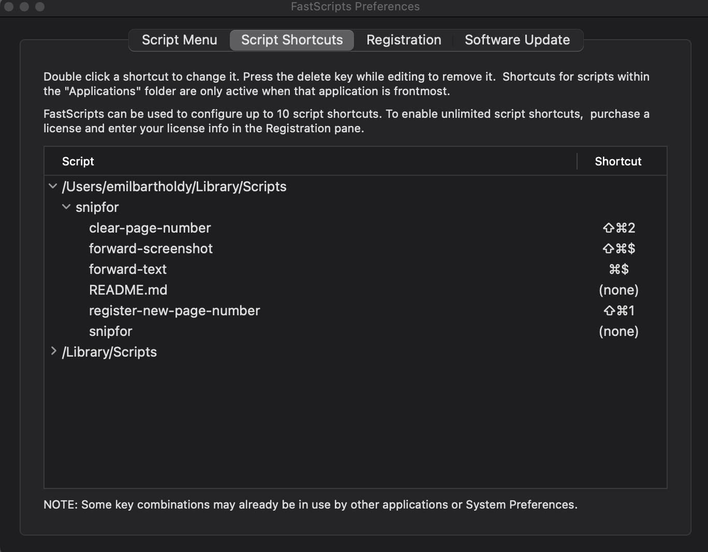

# SnipFor (for MacOS)

SnipFor (short for Snippet Forwarding) is a collection of scripts that pipes text and images into a selected markdown document. After setup the intention is:

1. When hitting a custom command the text in the pasteboard is automatically appended into the selected markdown document as a bullet point (maybe with attached page number).
2. When taking a screenshot it is inserted as an image in the selected markdown note document. The image itself is named something like `image-A45C.png` and is saved to an `images` folder.

This setup requires using `Automator` or `FastScripts` which can be downloaded [here](https://redsweater.com/fastscripts/). I recommend FastScripts as it simplifies setup.

Furthermore, it is recommended that you use `VS Code` for note-taking as it streams in file-changes, so that you can see text immediately appended to your notes.

## Setup

**Installing snipfor as a global command**

First we need to be able to select which folder and which document should receive forwarded text and pictures. First we install the `snipfor` command tool that does this.

1. Move this folder to your `/Users/$USER/Library/Scripts` folder.
2. Put following in `.zshrc`

  ```bash
    alias snipfor='/Users/$USER/Library/Scripts/snipfor/snipfor.sh'
  ```
Now you should be able to run the `snipfor` command from anywhere (might need to be marked executeable, see below.)

**Making SnipFor Scripts executable**

As SnipFor is just selection of bash scripts we need to make every script executable. Navigate to the snipfor folder:

```bash
cd /Users/$USER/Library/Scripts/snipfor
```

Make every script executable:

```bash
chmod 755 snipfor.sh
chmod 755 forward-screenshot.sh
chmod 755 forward-text.sh
chmod 755 register-new-page-number.sh
chmod 755 clear-page-number.sh
```

MacOS as strong privacy guarantees, which blocks SnipFor from manipulating files through FastScripts. To fix that, make sure that FastScripts has Full Disk Access under your Privacy Settings in Preferences.

**Registering keyboard-commands**

Finally, we can register keyboard commands. In `FastScripts` I have the following setup:




## Run

Starting SnipFor
```bash
snipfor start $(pwd) notes.md # Last parameter could be any name for your notes document, here it is notes.md
```

Stopping SnipFor
```bash
snipfor stop
```

## Troubleshoot

* If you get `permission` error, check that preview has full disk read and write access.
